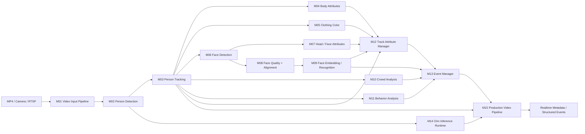
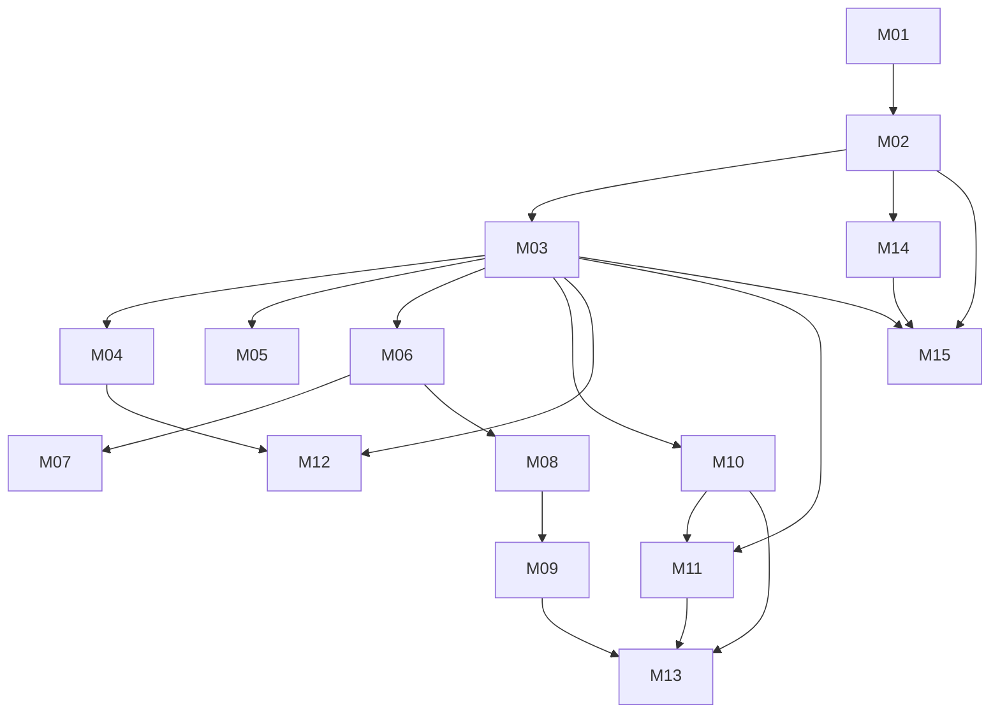

# Hệ thống Phân tích Video Thông minh trên NVIDIA Orin

## 1. Giới thiệu dự án

Dự án xây dựng một hệ thống phân tích video thời gian thực có khả năng tiếp nhận dữ liệu từ video, camera hoặc luồng RTSP; phát hiện và theo dõi con người; nhận diện các thuộc tính cơ thể, khuôn mặt và trang phục; phân tích đám đông, hành vi; đồng thời tổng hợp kết quả thành hồ sơ theo từng đối tượng và các sự kiện có cấu trúc.

Hệ thống được phát triển theo hai giai đoạn chính:

1. **Local baseline**: xây dựng và kiểm thử từng module độc lập trên file `input.mp4`, ưu tiên OpenCV, Python, ONNX Runtime và các thành phần đơn giản để rút ngắn vòng lặp phát triển.
2. **Production trên NVIDIA Orin**: chuyển model sang ONNX/TensorRT, tích hợp GStreamer/DeepStream, hỗ trợ camera hoặc RTSP và vận hành pipeline đa model theo thời gian thực.

Module đầu tiên được ưu tiên triển khai là **Person Detection (M02)**. Sau khi detector ổn định, hệ thống tiếp tục phát triển tracking, quản lý thuộc tính theo Track ID và các chức năng nâng cao.

---

## 2. Mục tiêu

### 2.1. Mục tiêu chính

- Đọc và giải mã video từ MP4, camera và RTSP.
- Phát hiện người trong từng frame.
- Gán Track ID và duy trì quỹ đạo của từng người theo thời gian.
- Nhận diện các thuộc tính toàn thân, trang phục, khuôn mặt và phần đầu.
- Trích xuất face embedding và hỗ trợ so khớp danh tính khi cần.
- Phân tích số lượng người, mật độ, vùng tập trung và hướng di chuyển.
- Phát hiện các hành vi hoặc tình huống như chạy, đứng lâu, đi sai hướng và xâm nhập vùng cấm.
- Làm ổn định kết quả nhận diện theo từng Track ID qua nhiều frame.
- Tổng hợp đầu ra AI thành các sự kiện có cấu trúc, tránh cảnh báo trùng lặp.
- Tối ưu suy luận và triển khai pipeline production trên NVIDIA Orin.

### 2.2. Mục tiêu kỹ thuật

- Thiết kế theo kiến trúc module, có thể phát triển và kiểm thử độc lập.
- Không chạy tất cả model ở mọi frame nếu không cần thiết.
- Ưu tiên model nhẹ, dễ chuyển đổi ONNX và TensorRT.
- Tách biệt logic AI, quản lý trạng thái, rule engine và hạ tầng video.
- Có khả năng thay thế model hoặc tracker mà không phải viết lại toàn bộ pipeline.
- Duy trì timestamp, FPS và Track ID nhất quán xuyên suốt hệ thống.

---

## 3. Phạm vi dự án

### 3.1. Trong phạm vi

- Video input từ MP4 trong giai đoạn đầu.
- Camera và RTSP trong giai đoạn production.
- Person detection, tracking và quản lý quỹ đạo.
- Nhận diện thuộc tính cơ thể, trang phục, màu sắc và khuôn mặt.
- Phân tích đám đông và hành vi dựa trên tracking, hình học và luật nghiệp vụ.
- Face embedding và so khớp danh tính khi có dữ liệu tham chiếu hợp lệ.
- Temporal voting, cache và state management theo Track ID.
- Event manager với state machine, cooldown và chống cảnh báo lặp.
- Tối ưu model bằng ONNX và TensorRT.
- Tích hợp DeepStream/GStreamer trên NVIDIA Orin.

### 3.2. Ngoài phạm vi giai đoạn đầu

- Huấn luyện một model crowd analysis lớn chuyên biệt.
- Pose estimation trên mọi frame và mọi đối tượng.
- Nhận diện đầy đủ mọi loại hành vi phức tạp bằng video action recognition nặng.
- Triển khai production multi-camera ngay từ phiên bản baseline.
- Sử dụng AI nặng cho phân loại màu quần áo ở phiên bản đầu.
- Suy luận tất cả thuộc tính trên mọi frame.

---

## 4. Kiến trúc tổng thể



### 4.1. Các lớp chính

#### Lớp tiếp nhận video

Phụ trách đọc nguồn video, giải mã frame, quản lý FPS, timestamp và trạng thái nguồn vào.

#### Lớp suy luận AI

Bao gồm detection, attribute recognition, face detection, face embedding và các model tùy chọn.

#### Lớp tracking và phân tích thời gian

Duy trì Track ID, lịch sử vị trí, quỹ đạo, trạng thái tồn tại và biến động của từng đối tượng.

#### Lớp tổng hợp trạng thái

Làm ổn định kết quả theo thời gian, giảm nhiễu dự đoán, cache thuộc tính và tránh inference không cần thiết.

#### Lớp rule engine và event

Chuyển kết quả AI thành sự kiện nghiệp vụ, quản lý cooldown, chống lặp và vòng đời sự kiện.

#### Lớp triển khai production

Tối ưu model và tích hợp pipeline đa luồng trên NVIDIA Orin bằng ONNX, TensorRT, GStreamer và DeepStream.

---

## 5. Luồng xử lý dữ liệu

1. **Video Input Pipeline** đọc frame từ nguồn video và gắn timestamp.
2. **Person Detection** nhận frame và trả về danh sách bounding box người.
3. **Person Tracking** nhận detection, gán Track ID và cập nhật quỹ đạo.
4. Từ mỗi track, hệ thống lựa chọn thời điểm phù hợp để chạy:
   - thuộc tính toàn thân;
   - màu áo và màu quần;
   - face detection;
   - thuộc tính khuôn mặt/phần đầu;
   - face quality, alignment và embedding.
5. **Track Attribute Manager** gom kết quả nhiều frame thành hồ sơ ổn định cho từng Track ID.
6. **Crowd Analysis** sử dụng vị trí và lịch sử track để tính số lượng, mật độ và hướng di chuyển.
7. **Behavior Analysis** áp dụng các luật trên quỹ đạo và vùng quan tâm.
8. **Event Manager** tổng hợp các tín hiệu AI thành structured event và áp dụng cooldown.
9. Trong môi trường production, toàn bộ pipeline được tối ưu và điều phối bởi DeepStream/GStreamer trên NVIDIA Orin.

---

## 6. Danh mục module

## M01 — Video Input Pipeline

| Thuộc tính | Nội dung |
|---|---|
| Nhóm | Video |
| Mục tiêu | Đọc video/camera, giải mã frame, quản lý FPS và timestamp |
| Công nghệ | OpenCV ở baseline; GStreamer/DeepStream khi production |
| Tài nguyên | CPU / Video Engine |
| Ưu tiên | P0 |
| Trạng thái | Hoàn tất — local baseline |
| Phụ thuộc | Không |
| Input | MP4 / Camera / RTSP |
| Output | Frame + timestamp |
| Ghi chú | Hiện tại chỉ dùng `input.mp4` |

### Trách nhiệm

- Mở và kiểm tra nguồn video.
- Đọc frame liên tục và phát hiện trạng thái kết thúc luồng.
- Đo hoặc giữ FPS nguồn.
- Tạo timestamp cho từng frame.
- Cung cấp frame index, kích thước frame và metadata nguồn.
- Kiểm soát tốc độ đọc khi chạy gần thời gian thực.
- Phát hiện lỗi nguồn và hỗ trợ reconnect ở giai đoạn RTSP.

### Đầu ra đề xuất

```python
VideoFrame = {
    "source_id": str,
    "frame_id": int,
    "timestamp_ms": int,
    "fps": float,
    "width": int,
    "height": int,
    "image": "numpy.ndarray"
}
```

---

## M02 — Person Detection

| Thuộc tính | Nội dung |
|---|---|
| Nhóm | Detection |
| Mục tiêu | Phát hiện người và trả bounding box |
| Công nghệ | YOLO11n → ONNX → TensorRT |
| Tài nguyên | GPU trên Orin |
| Ưu tiên | P0 |
| Trạng thái | Hoàn tất — local baseline |
| Phụ thuộc | M01 |
| Input | Frame |
| Output | `PersonDetection[]` |
| Ghi chú | Module được triển khai đầu tiên |

### Trách nhiệm

- Nhận frame từ M01.
- Resize, normalize và chuẩn hóa input cho model.
- Chạy inference person detection.
- Lọc class người.
- Áp dụng confidence threshold và NMS.
- Quy đổi bounding box về tọa độ frame gốc.
- Đính kèm confidence, class ID và thời gian inference.

### Đầu ra đề xuất

```python
PersonDetection = {
    "bbox_xyxy": [float, float, float, float],
    "confidence": float,
    "class_id": int,
    "class_name": "person"
}
```

### Tiêu chí hoàn thành

- Chạy được trên `input.mp4`.
- Bounding box đúng tỷ lệ trên frame gốc.
- Có cấu hình confidence và IoU threshold.
- Có thống kê FPS và latency.
- Export thành công ONNX.
- Có thể build TensorRT engine trên đúng target Orin.

---

## M03 — Person Tracking

| Thuộc tính | Nội dung |
|---|---|
| Nhóm | Tracking |
| Mục tiêu | Gán Track ID và duy trì quỹ đạo người theo thời gian |
| Công nghệ | ByteTrack hoặc DeepStream Tracker |
| Tài nguyên | CPU/GPU tùy tracker |
| Ưu tiên | P1 |
| Trạng thái | Hoàn tất — local baseline |
| Phụ thuộc | M02 |
| Input | `PersonDetection[]` |
| Output | `Track[]` |
| Ghi chú | Thực hiện sau khi detector ổn định |

### Trách nhiệm

- Ghép detection giữa các frame.
- Cấp và duy trì Track ID.
- Xử lý track mới, track đang hoạt động, track mất tạm thời và track kết thúc.
- Lưu lịch sử tâm bounding box và timestamp.
- Tính vận tốc, hướng và thời gian tồn tại.
- Cung cấp dữ liệu cho crowd analysis, behavior analysis và attribute manager.

### Đầu ra đề xuất

```python
Track = {
    "track_id": int,
    "bbox_xyxy": [float, float, float, float],
    "confidence": float,
    "state": "new|active|lost|removed",
    "age_frames": int,
    "last_seen_ms": int,
    "trajectory": [[float, float, int]]
}
```

---

## M04 — Person Attribute Recognition

| Thuộc tính | Nội dung |
|---|---|
| Nhóm | Attributes |
| Mục tiêu | Nhận diện thuộc tính toàn thân: trang phục, mũ, kính, balo, tay áo... |
| Công nghệ | Lightweight multi-label PAR model |
| Tài nguyên | CPU local baseline; GPU trên Orin sau |
| Ưu tiên | P1 |
| Trạng thái | Đang thực hiện — M04-00/M04-01 hoàn tất |
| Phụ thuộc | M03 |
| Input | Person crop theo Track ID |
| Output | Body attributes |
| Ghi chú | Ưu tiên model nhẹ |

### Thuộc tính dự kiến

- Loại áo hoặc kiểu trang phục.
- Tay dài/tay ngắn.
- Có/không có balo hoặc túi.
- Có/không có mũ.
- Có/không có kính nếu chất lượng crop cho phép.
- Các thuộc tính toàn thân phù hợp với model được chọn.

### Nguyên tắc triển khai

- Không inference ở mọi frame.
- Chỉ chạy khi crop đủ lớn và đủ rõ.
- Có khoảng nghỉ giữa hai lần inference trên cùng Track ID.
- Kết quả phải được đưa qua M12 để temporal voting.

### Phạm vi local baseline

- Namespace ổn định khi đưa kết quả vào M12 là `body`.
- Taxonomy boolean ban đầu gồm `backpack`, `bag`, `hat` và `long_sleeve`.
- `glasses` chỉ được bổ sung sau khi model và chất lượng person crop chứng minh
  kết quả phù hợp.
- Màu áo/quần thuộc M05 và không nằm trong M04.
- Recognizer nhận person crop BGR `uint8` và chỉ trả contract
  framework-independent; tensor, logits hoặc object backend không được thoát
  khỏi module.
- Local baseline phải chạy được trên CPU khi chưa có NVIDIA Orin.

### Chuỗi task M04

1. **M04-00 — Scope and roadmap**
   - Mở phạm vi M04 trong `AGENTS.md`.
   - Đồng bộ roadmap và trạng thái hiện tại.
2. **M04-01 — Contracts and taxonomy**
   - Chốt `BodyAttributeKey`, `BodyAttributePrediction` và
     `BaseBodyAttributeRecognizer`.
   - Unit test validation, immutability, JSON shape và backend isolation.
3. **M04-02 — Model evaluation**
   - So sánh các model pretrained nhẹ bằng tập crop có nhãn thủ công.
   - Kiểm tra license, label coverage, preprocessing và latency CPU.
4. **M04-03 — Crop and quality gate**
   - Clip bbox, reject crop lỗi/quá nhỏ và tính quality score deterministic.
5. **M04-04 — Local model adapter**
   - Implement backend được chọn, preprocessing và label mapping.
6. **M04-05 — M03/M04/M12 integration**
   - Schedule theo Track ID, tạo `AttributeObservation` và temporal voting.
7. **M04-06 — Artifacts and benchmark**
   - Xuất stable body attributes, latency riêng và smoke-test artifacts.

### Tiêu chí hoàn thành local baseline

- Regression test M01–M03 và M12 vẫn pass.
- Contract/taxonomy, crop gate và label mapping có unit test.
- Không inference mọi frame; số lần inference được báo trong artifact.
- Stable body attributes được tạo qua temporal voting của M12.
- Có đánh giá trên person crop được gắn nhãn thủ công.
- JSON artifact parse được và latency M04 được đo riêng.
- Không mở rộng sang clothing color, face attributes hoặc ReID.

---

## M05 — Clothing Color

| Thuộc tính | Nội dung |
|---|---|
| Nhóm | Attributes |
| Mục tiêu | Nhận diện màu áo và màu quần |
| Công nghệ | HSV/LAB + dominant color; classifier nếu cần |
| Tài nguyên | CPU trước |
| Ưu tiên | P2 |
| Trạng thái | Chưa bắt đầu |
| Phụ thuộc | M03 |
| Input | Upper/lower body crop |
| Output | Upper color / lower color |
| Ghi chú | Không dùng AI nặng ở bản đầu |

### Phương pháp baseline

- Chia person crop thành vùng thân trên và thân dưới.
- Loại bỏ vùng nền nếu có thể.
- Chuyển đổi không gian màu sang HSV hoặc LAB.
- Tìm màu chiếm ưu thế bằng histogram, clustering nhẹ hoặc luật ngưỡng.
- Ánh xạ màu về tập nhãn chuẩn như đen, trắng, xám, đỏ, xanh dương, xanh lá, vàng, cam, tím, nâu.

### Hạn chế cần xử lý

- Ánh sáng thay đổi.
- Bóng đổ và phản xạ.
- Crop chứa nhiều nền.
- Người bị che khuất.
- Quần áo nhiều màu hoặc họa tiết.

---

## M06 — Face Detection

| Thuộc tính | Nội dung |
|---|---|
| Nhóm | Face |
| Mục tiêu | Phát hiện khuôn mặt trong person/head ROI |
| Công nghệ | Lightweight face detector → ONNX/TensorRT |
| Tài nguyên | GPU trên Orin |
| Ưu tiên | P1 |
| Trạng thái | Chưa bắt đầu |
| Phụ thuộc | M03 |
| Input | Person/head ROI |
| Output | Face box |
| Ghi chú | Chạy chọn lọc theo track |

### Trách nhiệm

- Tạo head ROI từ person box.
- Chỉ chạy khi đối tượng đủ gần hoặc ROI đủ lớn.
- Trả về face box theo tọa độ frame hoặc person crop.
- Chọn face tốt nhất khi có nhiều detection trong một person ROI.
- Cung cấp input cho M07 và M08.

---

## M07 — Head / Face Attributes

| Thuộc tính | Nội dung |
|---|---|
| Nhóm | Face |
| Mục tiêu | Nhận diện mũ, kính, khẩu trang, tóc dài/ngắn |
| Công nghệ | Lightweight multi-label classifier |
| Tài nguyên | GPU trên Orin |
| Ưu tiên | P2 |
| Trạng thái | Chưa bắt đầu |
| Phụ thuộc | M06 |
| Input | Head/face crop |
| Output | Head attributes |
| Ghi chú | Tách khỏi body PAR để nhận diện chi tiết nhỏ |

### Thuộc tính dự kiến

- Có/không có mũ.
- Có/không có kính.
- Có/không có khẩu trang.
- Tóc dài/tóc ngắn hoặc nhóm thuộc tính tóc phù hợp với model.

### Nguyên tắc

- Chỉ inference khi face/head crop đạt ngưỡng chất lượng.
- Không dùng một dự đoán đơn lẻ làm kết quả cuối.
- Tổng hợp theo Track ID bằng M12.

---

## M08 — Face Quality + Alignment

| Thuộc tính | Nội dung |
|---|---|
| Nhóm | Face |
| Mục tiêu | Chọn khuôn mặt tốt, căn chỉnh trước khi embedding |
| Công nghệ | OpenCV + landmark geometry |
| Tài nguyên | CPU |
| Ưu tiên | P2 |
| Trạng thái | Chưa bắt đầu |
| Phụ thuộc | M06 |
| Input | Face crop |
| Output | Aligned face |
| Ghi chú | Không cần model nặng ở bản đầu |

### Chỉ số chất lượng đề xuất

- Kích thước khuôn mặt.
- Độ nét hoặc blur score.
- Góc quay mặt nếu có landmark.
- Tỷ lệ che khuất.
- Độ sáng và độ tương phản.
- Mức độ nằm trong frame.

### Trách nhiệm

- Loại bỏ face crop quá nhỏ, mờ hoặc bị che nhiều.
- Căn chỉnh mắt và khuôn mặt theo landmark.
- Chọn các face crop tốt nhất của mỗi Track ID.
- Hạn chế số lần gửi sang face embedding.

---

## M09 — Face Embedding / Recognition

| Thuộc tính | Nội dung |
|---|---|
| Nhóm | Face |
| Mục tiêu | Trích xuất vector và so khớp danh tính |
| Công nghệ | Lightweight face embedding + cosine/FAISS |
| Tài nguyên | GPU + CPU |
| Ưu tiên | P2 |
| Trạng thái | Chưa bắt đầu |
| Phụ thuộc | M08 |
| Input | Aligned face |
| Output | Identity + score |
| Ghi chú | Kiểm tra license model trước production |

### Trách nhiệm

- Sinh embedding từ aligned face.
- Chuẩn hóa vector embedding.
- So khớp bằng cosine similarity hoặc FAISS.
- Áp dụng ngưỡng nhận dạng và trạng thái `unknown`.
- Lưu phiên bản model và phiên bản index để truy vết.
- Không đưa kết quả nhận dạng vào hồ sơ ổn định nếu chất lượng thấp.

### Lưu ý pháp lý và vận hành

- Kiểm tra license model và dữ liệu tham chiếu.
- Chỉ xử lý danh tính trong bối cảnh được phép.
- Có cơ chế audit, bảo vệ embedding và kiểm soát quyền truy cập.
- Không xem một điểm similarity đơn lẻ là bằng chứng tuyệt đối.

---

## M10 — Crowd Analysis

| Thuộc tính | Nội dung |
|---|---|
| Nhóm | Crowd |
| Mục tiêu | Đếm người, mật độ, vùng tập trung, hướng di chuyển |
| Công nghệ | Tracking + geometry + rules |
| Tài nguyên | CPU/GPU |
| Ưu tiên | P2 |
| Trạng thái | Chưa bắt đầu |
| Phụ thuộc | M03 |
| Input | Track history |
| Output | Crowd metrics |
| Ghi chú | Không cần model crowd lớn ở bản đầu |

### Chỉ số đầu ra dự kiến

- Số người hiện tại trong frame hoặc trong ROI.
- Số người đi vào/đi ra qua line crossing.
- Mật độ người theo vùng.
- Vùng tập trung đông.
- Hướng di chuyển chính.
- Tốc độ dòng người ở mức tổng hợp.

### Phương pháp

- Dùng tâm đáy bounding box làm vị trí đại diện trên mặt phẳng ảnh.
- Cấu hình polygon ROI và virtual line.
- Áp dụng smoothing cho count và density.
- Dùng lịch sử track để tránh đếm trùng.

---

## M11 — Behavior Analysis

| Thuộc tính | Nội dung |
|---|---|
| Nhóm | Behavior |
| Mục tiêu | Phát hiện chạy, đứng lâu, sai hướng, xâm nhập vùng, bất thường |
| Công nghệ | Trajectory rules; pose chọn lọc khi cần |
| Tài nguyên | CPU + GPU chọn lọc |
| Ưu tiên | P3 |
| Trạng thái | Chưa bắt đầu |
| Phụ thuộc | M03, M10 |
| Input | Track history + optional pose |
| Output | Behavior events |
| Ghi chú | Làm sau khi tracking ổn định |

### Các luật baseline

- **Running**: vận tốc track vượt ngưỡng trong một khoảng thời gian tối thiểu.
- **Loitering**: track tồn tại trong vùng quá thời gian cấu hình với độ dịch chuyển thấp.
- **Wrong-way**: vector di chuyển ngược hướng cho phép.
- **Intrusion**: track đi vào vùng cấm.
- **Abnormal movement**: thay đổi vận tốc hoặc hướng bất thường theo luật cấu hình.

### Nguyên tắc

- Ưu tiên rule-based trước.
- Pose chỉ chạy khi một luật cần xác minh thêm.
- Mọi event hành vi phải có thời gian bắt đầu, cập nhật và kết thúc.

---

## M12 — Track Attribute Manager

| Thuộc tính | Nội dung |
|---|---|
| Nhóm | System |
| Mục tiêu | Gom và làm ổn định thuộc tính theo Track ID qua nhiều frame |
| Công nghệ | Temporal voting + cache + state management |
| Tài nguyên | CPU |
| Ưu tiên | P1 |
| Trạng thái | Hoàn tất — local foundation |
| Phụ thuộc | M03, M04 |
| Input | Per-frame attributes |
| Output | Stable track profile |
| Ghi chú | Không inference mọi frame |

### Trách nhiệm

- Lưu trạng thái theo `track_id`.
- Cache kết quả model và thời điểm inference cuối.
- Chọn frame/crop tốt để inference.
- Tổng hợp nhiều dự đoán bằng voting hoặc weighted score.
- Giữ kết quả ổn định khi một vài frame bị nhiễu.
- Xóa state khi track kết thúc và hết thời gian lưu.

### Kết quả hiện tại

- Đã hoàn tất M12-01 đến M12-06: schema, lifecycle, bounded trajectory,
  attribute cache, inference scheduling và temporal voting deterministic.
- `TrackAttributeManager` đã được nối sau `ByteTrackTracker` và dùng timestamp
  thật từ `VideoSource`.
- Pipeline xuất `tracking_profiles.json` theo schema
  `m12.track_profiles.v1` và đo latency M12 riêng.
- Đã smoke test và xác minh artifact trên `data/input.mp4` cùng MOT17-09.
- Chưa tích hợp model thuộc tính; các module sau sẽ cung cấp
  `AttributeObservation` cho manager.

### Hồ sơ track đề xuất

```json
{
  "track_id": 42,
  "first_seen_ms": 1200,
  "last_seen_ms": 8450,
  "body_attributes": {
    "backpack": {"value": true, "score": 0.88},
    "long_sleeve": {"value": false, "score": 0.81}
  },
  "clothing": {
    "upper_color": "blue",
    "lower_color": "black"
  },
  "head_attributes": {
    "glasses": {"value": true, "score": 0.76}
  },
  "identity": {
    "label": "unknown",
    "score": 0.41
  }
}
```

---

## M13 — Event Manager

| Thuộc tính | Nội dung |
|---|---|
| Nhóm | System |
| Mục tiêu | Gom kết quả AI thành event và tránh cảnh báo lặp |
| Công nghệ | State machine + rule engine + cooldown |
| Tài nguyên | CPU |
| Ưu tiên | P3 |
| Trạng thái | Chưa bắt đầu |
| Phụ thuộc | M09, M10, M11 |
| Input | AI outputs |
| Output | Structured events |
| Ghi chú | Module hệ thống cuối |

### Trách nhiệm

- Chuẩn hóa các tín hiệu thành event schema chung.
- Quản lý vòng đời event: `started`, `active`, `ended`.
- Áp dụng cooldown theo loại event, camera, vùng và Track ID.
- Chống phát lặp cùng một cảnh báo ở các frame liên tiếp.
- Gắn snapshot, bounding box, profile và metadata liên quan nếu có.
- Phát event sang log, file, message broker hoặc API ở giai đoạn tích hợp.

### Event schema đề xuất

```json
{
  "event_id": "evt_20260101_000001",
  "event_type": "intrusion",
  "status": "started",
  "source_id": "camera_01",
  "timestamp_ms": 1760000000000,
  "track_ids": [42],
  "zone_id": "restricted_area_01",
  "confidence": 0.91,
  "attributes": {},
  "metadata": {
    "frame_id": 1024,
    "model_versions": {}
  }
}
```

---

## M14 — Orin Inference Runtime

| Thuộc tính | Nội dung |
|---|---|
| Nhóm | Deployment |
| Mục tiêu | Chạy model tối ưu trên Orin |
| Công nghệ | ONNX + TensorRT |
| Tài nguyên | NVIDIA Orin |
| Ưu tiên | P0 |
| Trạng thái | Tạm hoãn — chờ thiết bị Orin |
| Phụ thuộc | M02 |
| Input | ONNX model |
| Output | TensorRT inference |
| Ghi chú | Local deployment package đã sẵn sàng; chưa build engine |

### Trách nhiệm

- Export model từ framework gốc sang ONNX.
- Kiểm tra tính tương thích của ONNX graph.
- Build TensorRT engine trực tiếp trên target phù hợp.
- Quản lý precision FP32, FP16 hoặc INT8 tùy model và yêu cầu.
- Benchmark latency, throughput, GPU memory và độ chính xác.
- Chuẩn hóa interface inference để các module dùng chung.

### Lưu ý

TensorRT engine thường phụ thuộc vào kiến trúc GPU, phiên bản TensorRT, CUDA và môi trường build. Engine production phải được build và kiểm thử trên đúng target Orin hoặc môi trường tương thích.

---

## M15 — Production Video Pipeline

| Thuộc tính | Nội dung |
|---|---|
| Nhóm | Deployment |
| Mục tiêu | Tích hợp multi-model realtime camera pipeline |
| Công nghệ | DeepStream + GStreamer |
| Tài nguyên | NVIDIA Orin |
| Ưu tiên | P2 |
| Trạng thái | Chưa bắt đầu |
| Phụ thuộc | M02, M03, M14 |
| Input | Camera/RTSP |
| Output | Realtime metadata/events |
| Ghi chú | Chưa dùng ngay ở local baseline |

### Trách nhiệm

- Nhận một hoặc nhiều luồng camera/RTSP.
- Sử dụng hardware decoding khi có thể.
- Điều phối primary inference, tracker và secondary inference.
- Chuyển metadata giữa các thành phần.
- Quản lý queue, batch, độ trễ và backpressure.
- Tích hợp event output, logging, health check và reconnect.

---

## 7. Quan hệ phụ thuộc



### Đường găng kỹ thuật

Đường găng tối thiểu để có hệ thống hoạt động:

`M01 → M02 → M03 → M12`

Đường găng cho deployment Orin:

`M01 → M02 → M14 → M15`

Đường găng cho face recognition:

`M03 → M06 → M08 → M09`

Đường găng cho behavior event:

`M03 → M10/M11 → M13`

---

## 8. Mức độ ưu tiên

### P0 — Nền tảng bắt buộc

- M01 — Video Input Pipeline
- M02 — Person Detection
- M14 — Orin Inference Runtime

Mục tiêu của nhóm P0 là chứng minh pipeline đọc video, phát hiện người và chạy được model tối ưu trên Orin.

### P1 — Năng lực cốt lõi

- M03 — Person Tracking
- M04 — Person Attribute Recognition
- M06 — Face Detection
- M12 — Track Attribute Manager

Mục tiêu của nhóm P1 là tạo được hồ sơ ổn định theo từng người thay vì chỉ có kết quả rời rạc trên từng frame.

### P2 — Tính năng mở rộng

- M05 — Clothing Color
- M07 — Head / Face Attributes
- M08 — Face Quality + Alignment
- M09 — Face Embedding / Recognition
- M10 — Crowd Analysis
- M15 — Production Video Pipeline

### P3 — Phân tích và sự kiện nâng cao

- M11 — Behavior Analysis
- M13 — Event Manager

---

## 9. Kế hoạch triển khai đề xuất

## Giai đoạn 1 — Local Detection Baseline

### Phạm vi

- M01: đọc `input.mp4`.
- M02: YOLO11n person detection.
- Overlay bounding box lên video.
- Ghi log FPS, latency và số detection.
- Xuất video kết quả để kiểm tra trực quan.

### Kết quả mong đợi

- Pipeline chạy end-to-end trên máy phát triển.
- Có cấu hình model, input video và threshold.
- Có benchmark ban đầu.

---

## Giai đoạn 2 — ONNX và TensorRT trên Orin

### Phạm vi

- Export M02 sang ONNX.
- Kiểm tra output ONNX so với model gốc.
- Build TensorRT engine trên target Orin.
- Benchmark FP16 trước; cân nhắc INT8 nếu cần.
- Chuẩn hóa inference interface.

### Kết quả mong đợi

- M02 chạy ổn định trên Orin.
- Sai lệch đầu ra nằm trong mức chấp nhận được.
- Có báo cáo latency, FPS, GPU memory và nhiệt độ khi chạy dài.

---

## Giai đoạn 3 — Tracking và Track State

### Phạm vi

- M03: tích hợp ByteTrack ở local baseline.
- M12: xây dựng state theo Track ID.
- Lưu quỹ đạo và thời gian tồn tại.
- Kiểm thử ID switch, occlusion và track lost.

### Kết quả mong đợi

- Mỗi người có Track ID ổn định tương đối.
- Có lịch sử track để phục vụ các module sau.
- Không tạo mới thuộc tính ở mọi frame.

---

## Giai đoạn 4 — Person và Face Attributes

### Phạm vi

- M04: body PAR.
- M05: màu áo/quần bằng xử lý màu.
- M06: face detection.
- M07: head/face attributes.
- M08: face quality và alignment.
- M12: temporal voting cho toàn bộ thuộc tính.

### Kết quả mong đợi

- Mỗi Track ID có stable profile.
- Hệ thống biết chọn frame tốt để inference.
- Tổng tải inference được kiểm soát.

---

## Giai đoạn 5 — Recognition, Crowd và Behavior

### Phạm vi

- M09: face embedding/recognition.
- M10: count, density, zone và direction.
- M11: intrusion, wrong-way, loitering, running.
- Kiểm thử bằng video tình huống có ground truth thủ công.

---

## Giai đoạn 6 — Event Manager và Production Pipeline

### Phạm vi

- M13: event schema, lifecycle và cooldown.
- M15: DeepStream/GStreamer.
- RTSP reconnect, health check và structured output.
- Kiểm thử tải dài hạn trên Orin.

### Kết quả mong đợi

- Pipeline camera/RTSP chạy realtime.
- Metadata và event đầu ra có schema rõ ràng.
- Không phát cảnh báo lặp liên tục.

---

## 10. Công nghệ dự kiến

| Hạng mục | Công nghệ |
|---|---|
| Ngôn ngữ baseline | Python |
| Xử lý ảnh/video | OpenCV |
| Model detection | YOLO11n |
| Model interchange | ONNX |
| Inference production | TensorRT |
| Tracking local | ByteTrack |
| Tracking production | ByteTrack hoặc DeepStream Tracker |
| Video production | GStreamer, NVIDIA DeepStream |
| Face search | Cosine similarity hoặc FAISS |
| State management | Python/C++ in-memory cache ở baseline |
| Cấu hình | YAML hoặc JSON |
| Logging | Structured logging |
| Test | Pytest + video test cases |
| Profiling | FPS, latency, CPU, GPU, RAM, VRAM, nhiệt độ |

---

## 11. Cấu trúc thư mục đề xuất

```text
project/
├── README.md
├── requirements.txt
├── pyproject.toml
├── configs/
│   ├── app.yaml
│   ├── models.yaml
│   ├── zones.yaml
│   └── events.yaml
├── data/
│   ├── input/
│   │   └── input.mp4
│   ├── output/
│   └── samples/
├── models/
│   ├── source/
│   ├── onnx/
│   └── tensorrt/
├── src/
│   ├── video/
│   │   └── video_input.py
│   ├── detection/
│   │   └── person_detector.py
│   ├── tracking/
│   │   └── person_tracker.py
│   ├── attributes/
│   │   ├── body_attributes.py
│   │   └── clothing_color.py
│   ├── face/
│   │   ├── face_detector.py
│   │   ├── face_attributes.py
│   │   ├── face_quality.py
│   │   └── face_embedding.py
│   ├── analytics/
│   │   ├── crowd_analysis.py
│   │   └── behavior_analysis.py
│   ├── state/
│   │   ├── track_attribute_manager.py
│   │   └── event_manager.py
│   ├── runtime/
│   │   ├── onnx_runtime.py
│   │   └── tensorrt_runtime.py
│   ├── pipeline/
│   │   ├── local_pipeline.py
│   │   └── production_pipeline.py
│   ├── schemas/
│   │   ├── frame.py
│   │   ├── detection.py
│   │   ├── track.py
│   │   └── event.py
│   └── utils/
│       ├── geometry.py
│       ├── timing.py
│       ├── logging.py
│       └── visualization.py
├── scripts/
│   ├── export_onnx.py
│   ├── build_tensorrt.py
│   ├── benchmark.py
│   └── run_local.py
├── tests/
│   ├── unit/
│   ├── integration/
│   └── videos/
└── docs/
    ├── architecture.md
    ├── model_registry.md
    ├── event_schema.md
    └── deployment_orin.md
```

---

## 12. Cấu hình hệ thống đề xuất

```yaml
video:
  source: data/input/input.mp4
  source_id: local_video_01
  realtime: true

person_detection:
  model_path: models/onnx/yolo11n_person.onnx
  confidence_threshold: 0.35
  iou_threshold: 0.50
  input_size: [640, 640]

tracking:
  tracker: bytetrack
  track_buffer: 30
  match_threshold: 0.80

attributes:
  inference_interval_frames: 15
  min_person_height: 120
  voting_window: 5

face:
  enabled: false
  min_face_size: 48
  quality_threshold: 0.60

crowd:
  enabled: false
  zones_config: configs/zones.yaml

behavior:
  enabled: false
  loitering_seconds: 20
  running_speed_threshold: 1.5

events:
  cooldown_seconds: 10
  output_path: data/output/events.jsonl
```

Các giá trị trên chỉ là cấu hình khởi đầu và cần được hiệu chỉnh bằng dữ liệu thực tế.

---

## 13. Yêu cầu phi chức năng

### Hiệu năng

- Pipeline phải đo được FPS và latency theo từng module.
- Có thể cấu hình giảm tần suất inference cho secondary models.
- Tránh copy frame không cần thiết.
- Production ưu tiên hardware decoding và TensorRT FP16.

### Khả năng mở rộng

- Mỗi module có interface input/output rõ ràng.
- Cho phép bật/tắt module bằng cấu hình.
- Có thể thay model mà không thay đổi event schema.
- Có thể hỗ trợ nhiều nguồn video ở giai đoạn production.

### Độ tin cậy

- Xử lý được frame lỗi hoặc nguồn video kết thúc.
- Có reconnect cho RTSP.
- Có timeout và cleanup state cho track đã mất.
- Có log lỗi và metric sức khỏe pipeline.

### Quan sát hệ thống

- FPS tổng và FPS từng module.
- Latency trung bình, p95 và p99 nếu có.
- CPU, RAM, GPU, VRAM và nhiệt độ.
- Số track đang hoạt động.
- Số lần inference của từng model.
- Số event theo loại.

### Bảo mật và quyền riêng tư

- Hạn chế lưu frame hoặc crop nếu không cần thiết.
- Face embedding cần được bảo vệ và kiểm soát quyền truy cập.
- Có chính sách lưu trữ và xóa dữ liệu.
- Ghi nhận phiên bản model và cấu hình khi sinh event.

---

## 14. Chiến lược tối ưu hiệu năng

- Chỉ chạy detection theo tốc độ cần thiết; có thể bỏ frame nếu pipeline quá tải.
- Chạy tracking trên mọi frame hoặc gần mọi frame để duy trì quỹ đạo.
- Chạy body/face attributes theo chu kỳ trên từng Track ID.
- Chọn crop tốt nhất thay vì crop mới nhất.
- Batch secondary inference khi kiến trúc production hỗ trợ.
- Chỉ chạy face pipeline với track đủ lớn và nhìn thấy đầu/khuôn mặt.
- Cache kết quả ổn định và chỉ cập nhật khi có bằng chứng mới tốt hơn.
- Sử dụng FP16 trên Orin khi độ chính xác đáp ứng yêu cầu.
- Dùng INT8 chỉ sau khi có tập calibration phù hợp và kiểm tra sai lệch.

---

## 15. Kiểm thử

### Unit test

- Chuyển đổi tọa độ bounding box.
- NMS và threshold filtering.
- Tính tâm, vận tốc, hướng và line crossing.
- Temporal voting.
- Event cooldown và state transition.
- Color mapping trong HSV/LAB.

### Integration test

- M01 → M02 trên video ngắn.
- M02 → M03 với nhiều người và che khuất.
- M03 → M12 với lịch inference không liên tục.
- M06 → M08 → M09 trên face crop đạt và không đạt chất lượng.
- M10/M11 → M13 với event lặp nhiều frame.

### Video test cases

- Một người đi ngang camera.
- Nhiều người giao nhau.
- Người bị che khuất ngắn hạn.
- Người ra khỏi frame rồi quay lại.
- Người đi vào vùng cấm.
- Người đứng lâu trong ROI.
- Người đi ngược hướng.
- Thay đổi ánh sáng.
- Khuôn mặt nhỏ, nghiêng hoặc mờ.

### Benchmark

Mỗi lần benchmark cần lưu:

- Phiên bản code.
- Phiên bản model.
- Thiết bị và môi trường.
- Độ phân giải video.
- FPS input.
- Precision của TensorRT.
- FPS output.
- Latency trung bình và p95.
- CPU/GPU/RAM/VRAM.
- Tỷ lệ dropped frame.

---

## 16. Tiêu chí nghiệm thu theo mức

### Nghiệm thu P0

- Đọc được `input.mp4`.
- Phát hiện người và vẽ đúng bounding box.
- Có timestamp và FPS.
- Export ONNX thành công.
- Chạy được TensorRT trên Orin.
- Có benchmark và hướng dẫn chạy.

### Nghiệm thu P1

- Track ID được duy trì qua nhiều frame.
- Có track history.
- Person crop được tạo đúng theo Track ID.
- Thuộc tính được tổng hợp ổn định theo thời gian.
- Face detection chạy chọn lọc.

### Nghiệm thu P2

- Nhận diện màu áo/quần ở mức baseline.
- Có face quality và alignment.
- Có embedding và cơ chế `unknown`.
- Có crowd metrics theo ROI.
- Pipeline DeepStream/GStreamer nhận được camera/RTSP.

### Nghiệm thu P3

- Có ít nhất các luật intrusion, wrong-way và loitering.
- Event có vòng đời và cooldown.
- Không phát cùng một cảnh báo ở mọi frame.
- Event output có schema thống nhất.

---

## 17. Rủi ro và phương án giảm thiểu

| Rủi ro | Ảnh hưởng | Giảm thiểu |
|---|---|---|
| Detector không ổn định | Tracking và toàn bộ module sau sai | Kiểm thử detector trước; chuẩn hóa preprocessing/postprocessing |
| ID switch khi che khuất | Hồ sơ thuộc tính bị gán nhầm | Tuning tracker, lưu lịch sử, cân nhắc ReID khi cần |
| Secondary model quá nặng | Không đạt realtime | Inference chọn lọc, batch, model nhẹ, FP16 |
| Face quá nhỏ hoặc mờ | Recognition sai | Quality gate, chỉ nhận dạng từ crop tốt |
| Màu quần áo bị lệch do ánh sáng | Nhãn màu không ổn định | LAB/HSV, voting nhiều frame, hiệu chỉnh theo camera |
| TensorRT engine không tương thích | Không chạy trên target | Build trên đúng Orin và cố định version môi trường |
| RTSP không ổn định | Mất dữ liệu | Reconnect, timeout, queue và health check |
| Event lặp | Cảnh báo quá nhiều | State machine, deduplication và cooldown |
| Lưu quá nhiều state | Tăng RAM | TTL, cleanup track và giới hạn lịch sử |
| License model không phù hợp | Rủi ro production | Rà soát license trước khi tích hợp chính thức |
| Vấn đề quyền riêng tư | Rủi ro pháp lý | Giảm lưu dữ liệu, phân quyền, mã hóa và audit |

---

## 18. Đầu ra cuối cùng của hệ thống

Hệ thống dự kiến cung cấp ba nhóm đầu ra:

### Realtime metadata

- Frame ID và timestamp.
- Bounding box người.
- Track ID.
- Face box.
- Thuộc tính từng đối tượng.
- Crowd metrics.

### Stable track profile

- Thời gian xuất hiện.
- Thuộc tính cơ thể và phần đầu.
- Màu trang phục.
- Identity hoặc `unknown`.
- Confidence đã được tổng hợp theo thời gian.

### Structured events

- Loại event.
- Trạng thái event.
- Camera/source.
- Track liên quan.
- Zone liên quan.
- Timestamp.
- Confidence.
- Snapshot hoặc metadata tham chiếu nếu được phép lưu.

---

## 19. Trạng thái hiện tại

- M01, M02 và M03 đã có local implementation, test và artifact.
- M12-01 đến M12-06 đã hoàn tất ở mức local foundation.
- M04 là milestone hiện tại; M04-00 và M04-01 đã hoàn tất phạm vi,
  contract cùng taxonomy.
- Chưa có NVIDIA Orin tại môi trường phát triển, vì vậy M14 tạm hoãn.
- M05–M11, M13 và M15 chưa nằm trong milestone hiện tại.
- Kiến trúc production với GStreamer/DeepStream chưa được áp dụng.

---

## 20. Bước tiếp theo đề xuất

1. Hoàn tất M04-00: mở phạm vi và đồng bộ roadmap.
2. Hoàn tất M04-01: chốt contracts và taxonomy bằng unit test.
3. Thực hiện M04-02: đánh giá model PAR pretrained nhẹ trên local CPU.
4. Thực hiện M04-03: person crop và quality gate.
5. Thực hiện M04-04: local model adapter.
6. Thực hiện M04-05: tích hợp M03 → M04 → M12.
7. Thực hiện M04-06: artifact, benchmark và smoke test.
8. Quay lại M14 khi có thiết bị NVIDIA Orin.

---

## 21. Tóm tắt

Dự án là một hệ thống video analytics dạng module, lấy person detection và tracking làm lõi. Các chức năng nhận diện thuộc tính, khuôn mặt, đám đông và hành vi đều dựa trên Track ID và lịch sử theo thời gian. Kiến trúc ưu tiên model nhẹ, inference chọn lọc và temporal aggregation để đáp ứng giới hạn tài nguyên trên NVIDIA Orin.

Local foundation `M01 → M02 → M03 → M12` đã hoàn tất. Khi chưa có thiết
bị Orin, bước tiếp theo là M04 local baseline để tạo body attribute
observations và tận dụng scheduling/temporal voting của M12. M14 được tiếp
tục khi có thiết bị phù hợp; các secondary model khác và M15 vẫn được tích
hợp dần sau khi từng contract local ổn định.
